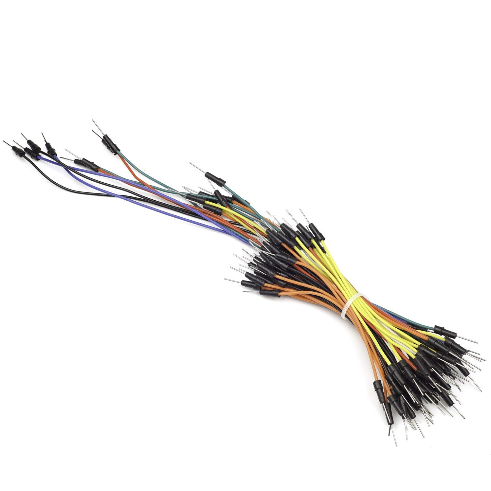

# Hardwarebeschreibung 

In diesem Dokument finden Sie eine detailierte Beschreibung der benutzten Hardware für das Spiel "Galactic Energies". Es dient als Hilfestellung  für die Wartung der Hardwarekomponenten, bei allfälligen Funktionsverlusten. Des Weiteren ist dokumentiert wo die jeweiligen Komponenten erhältlich sind. 

## Hardwareliste 

**1. Raspberry Pi 4 Model B** 

***Beschreibung***

Der Raspberry Pi 4 Model B ist ein Einplatinencomputer, der von der Raspberry Pi Foundation entwickelt wurde. 

Der Raspberry Pi 4 wird von einem leistungsstarken Broadcom BCM2711 Quad-Core-Prozessor mit einer 64-Bit-Architektur angetrieben, der mit 1,5 GHz getaktet ist. Je nach Modellvariante stehen unterschiedliche Arbeitsspeicheroptionen zur Verfügung, darunter 2 GB, 4 GB oder sogar 8 GB LPDDR4-SDRAM.

Der Raspberry Pi 4 verfügt über zahlreiche Anschlussmöglichkeiten, darunter zwei HDMI-Anschlüsse, die es ermöglichen, zwei 4K-Monitore gleichzeitig anzuschließen. Es gibt auch zwei USB-3.0-Anschlüsse, zwei USB-2.0-Anschlüsse, einen Gigabit-Ethernet-Port, einen microSD-Kartensteckplatz und einen 3,5-mm-Audioausgang. Zudem gibt es einen CSI-Kameraport und einen DSI-Displayport, die den Anschluss einer Kamera bzw. eines Touchscreens ermöglichen.

Mehr Informationen zum Raspberry Pi 4 Model B finden Sie https://www.toppreise.ch/preisvergleich/Einplatinencomputer/RASPBERRY-Pi-4-Model-B-4GB-p562897?posf=1[hier].

**2. Hancaner Hochleistundsladegerät**

***Beschreibung***

Das Hancaner Hochleistungs-Ladegerät ist ein tragbarer Handkurbel-Generator.
Der Generator nutzt die kinetische Energie, die durch das Drehen der Handkurbel erzeugt wird, um elektrische Energie zu erzeugen.
Diese Kurbel ist durch zwei Kupferkabel mit dem Strommesser INA219 verbunden.Der Pluspol der Kurbel ist duch das rote Kupferkabel verbunden und der Minuspol durch das schwarze Kupferkabel. Die Kurbel kann bis zu 20 Watt produzieren. 

Mehr Informationen zur Kurbel finden Sie https://www.amazon.de/handkurbel-generator-Hancaner-Hochleistungs-Ladegerät-Handkurbel/dp/B09VLC6VMM/ref=pd_vtp_h_pd_vtp_h_sccl_2/262-9708940-8461952?pd_rd_w=4jFcp&content-id=amzn1.sym.d9eee8d5-1140-4c78-983a-746c7af2b0c7&pf_rd_p=d9eee8d5-1140-4c78-983a-746c7af2b0c7&pf_rd_r=DKCWCMW15PGDQG3NN5X5&pd_rd_wg=kBYNx&pd_rd_r=92510b41-e604-4ef7-a926-52d618225010&pd_rd_i=B09VLC6VMM&psc=1[hier].

image::./images/Hankurbel_Generator_Hancaner_Hochleistundsladegerät_.png[Raspberry_Pi_4_Model_B, 300]

***Verkabelung***

image::./images/Kurbelverkabelung.png[Raspberry_Pi_4_Model_B, 400]

**3. Vikye Game Joystick**

***Beschreibung***

Der Vikye Game Joystick ist ein Arcade-Spiel-Joystick. Es handelt sich um einen einzelnen Joystick, der speziell für Holz- und Metallsteuerungspanels in Arcade-Spielkonsolen oder anderen ähnlichen Geräten konzipiert ist. Der Joystick verfügt über einen traditionellen Stil und kann in verschiedenen Modi betrieben werden, darunter 2-Wege, 4-Wege und 8-Wege. 

Mehr Informationen zum Joystick finden Sie https://www.amazon.com/Joystick-Classic-Adjustable-Competition-Cabinet/dp/B07W85JP89[hier].

***Verkabelung***

**4. Baolian Japanese Arcade Button**

***Beschreibung***

Der Baolian Japanese Arcade Button ist hochwertiger Arcade-Knopf. Er hat einen Durchmesser von 30mm. 

Mehr Informationen zum Button finden Sie https://www.arcadexpress.com/en/buttons-arcade-pushbuttons/239-470-boton-arcade-japones-baolian-.html?post=1[hier].

***Verkabelung***

**5. High Side-DC-Stromschalter INA219**

***Beschreibung***

Der High-Side-DC-Stromschalter INA219 ist ein integrierter Schaltkreis, der entwickelt wurde, um den Strom in einem Gleichstromkreis zu messen und zu steuern. Er bietet präzise und zuverlässige Messungen des Stromverbrauchs in Anwendungen wie Elektronikprojekten, Energiemanagement und Batterieüberwachung.
Der INA219 verfügt über einen integrierten Shunt-Widerstand und einen ADC (Analog-Digital-Wandler), der es ihm ermöglicht, den Stromfluss durch den Shunt-Widerstand zu messen. Der Shunt-Widerstand erzeugt eine Spannung proportional zum Strom, und der INA219 wandelt diese Spannung in einen digitalen Wert um.

Mehr Informationen zum Button finden Sie https://www.distrelec.ch/de/high-side-dc-stromschalter-ina219-adafruit-904/p/30091225[hier].

***Verkabelung***

**6. Jumperkabel**

***Beschreibung***

Jumperkabel sind flexible Drahtverbindungen, die zum einfachen Verbinden von elektronischen Komponenten in elektronischen Schaltungen verwendet werden. Sie bestehen aus dünnen isolierten Drähten mit Stift- oder Buchsenanschlüssen an den Enden.

Mehr Informationen zu den Jumperkabel finden Sie https://www.play-zone.ch/de/jumperkabel-verbindungskabel-10-20cm-m-m-30-stk.html[hier].

***Verkabelung am Picadex***

***Joystick***

* Grau    U

* Rot     D

* Schwarz GND

***Button***

* Schwarz ENT

* Weiss   ENT

***Kurbel***

* Orange    SDA

* Grün      SCL

* Braun     GND

* Gelb      5V

**7. Kupferkabel**

***Beschreibung***

Die Kupferkabel wurden benutzt um den Joystick, Button und Strommesser mit dem Raspberry Pi zu verbinden. 
 
Mehr Informationen zu den Jumperkabel finden Sie https://www.schlanser.ch/elektro/energieversorgung/stecker-kabel-adapter/50854/flexible-pvc-aderleitung-blau-6-mm2-laenge-5-m?sPartner=gs[hier].

