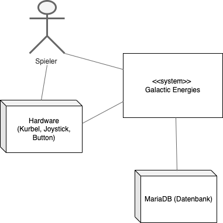
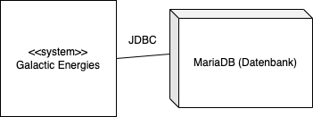

[[section-system-scope-and-context]]
== Kontextabgrenzung

=== Fachlicher Kontext

[role="arc42help"]
****

**Beschreibung**

***Hardware (Kurbel, Joystick, Button)***
Mit der Hardware wird das Spiel gesteuert. Durch die Kurbel fliegt die Rakete schneller und es wird Strom erzeugt. Mit hilfe des Joysticks kann die Menuauswahl und die Rakete gesteuert werden. Durch das Drücken des Buttens kann das Intro oder das Spiel gestartet werden.  

***Spieler***
Der Spieler steuert duch die Hardware-Komponenten das System. 

***Datenbank*** 
System schreibt alle Endresultate in die Datenbank. System liest die Verbrauchsinformationen (Strom) der Alltagsgegenstände. System liest alle Endresultate, sortiert diese und stellt sie als Highscores dar.
****

=== Technischer Kontext
[role="arc42help"]
****

**Beschreibung**

***Datenbank*** 
Java Database Connectivity(JDBC). Wird vom System für lesenden und schreibenden Zugriff verwendet.  
****

