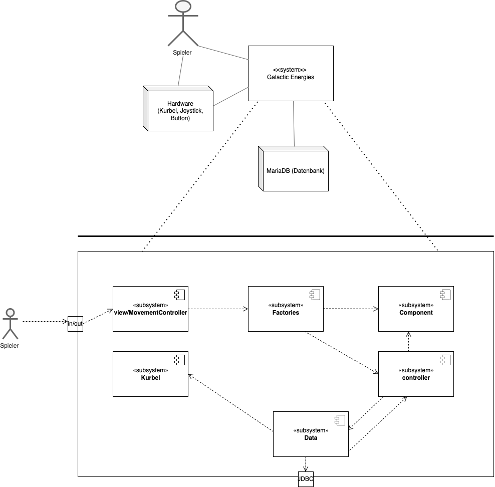
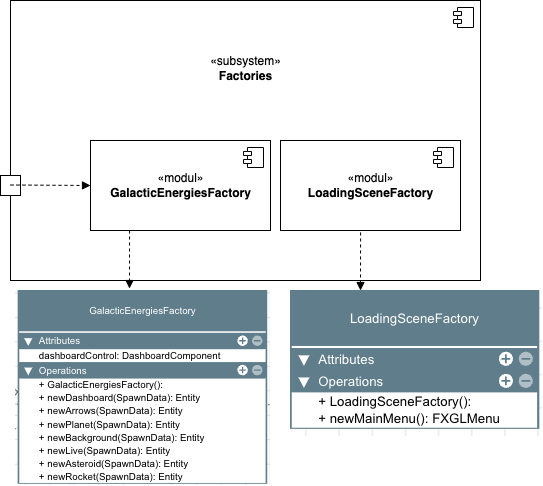
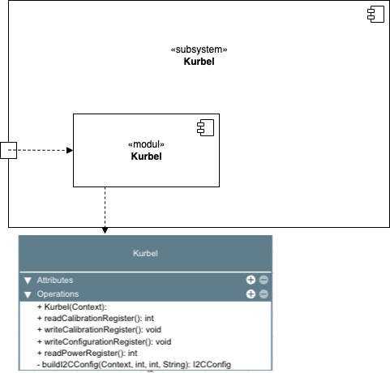

[[section-building-block-view]]
== Bausteinsicht

=== Whitebox Gesamtsystem
[role="arc42help"]
****

****

=== Ebene 1
[role="arc42help"]
****
[cols="1,2" options="header"]
|===
| **Subsystem** | **Kurzbeschreibung 
| view/MovementController | Beinhaltet die Spielsettings 
| Factories | Ist zuständig für die Erstellung der Spielobjekte wie z.B. Rakete, Asteroiden, etc. 
| Component | Die Components beinhalten die Spiellogik der der jeweiligen Komponente wie z.B. die Rakete die sich nach oben und unten bewegt
| Controller | Controller steuerern die Entities 
| Data | Dient zur Verbindung mit der Datenbank und wertet den erzeugten Strom aus 
| Kurbel | Initialisiert die Kurbel
|===

****

=== Ebene 2

[role="arc42help"]
****

**Beschreibung**

***GalacticEnergiesFactory***
Die @spawn-Methoden sorgen dafür dass die jeweiligen Spielobjekte im Spiel auftauchen.

***LoadingSceneFactory***
Initialisiert das Mainmenu von der FXGL Library 
****

Whitebox _ch.fhnw.galacticenergies_

[role="arc42help"]
****

Für eine genauere Einsicht in das Spiel System steht das Klassendiagramm zur Verfügung: https://gitlab.fhnw.ch/ip12-22vt/ip12-22vt_digitaleralltag/docu/-/blob/main/software(sad)/src/Klassendiagramm.pdf[Klassendiagramm]

[cols="1,2" options="header"]
|===
| **Methode** | **Kurzbeschreibung 
| buildI2CConfig | Verbindet Kurbel mit Java
| writeConfigurationRegister | Kalibriert das Konfigurationsregister des Strommessers
| writeCalibrationRegister | Kalibriert das Kalibrierungsregister des Strommessers
| readCalibrationRegister | Liest den Wert des Kalibrierungsregister ab 
| readPowerRegister | Liest das Powerregister des Strommessers 
|===

Whitebox _ch.fhnw.Kurbel_
****

