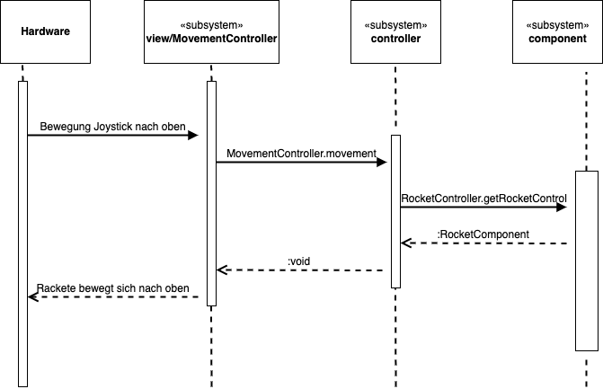
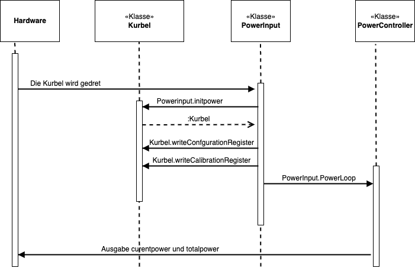

[[section-runtime-view]]
== Laufzeitsicht
[role="arc42help"]
****

****

=== Laufzeitsicht 1: Bewegung der Rackete mit dem Joystick
[role="arc42help"]
****

**Beschreibung**

1. Der Spielnutzer hat die Möglichkeit den Joystick nach Oben und nach Unten zu bewegen. Dementsprechend bewegt sich auch die Rackete.

2. In diesem Beispiel entscheidet sich der Nutzer den Joystick nach oben zu bewegen.

3. Im Subsystem view/MovementController wird die Methode MovementController.movement() aufgerufen. 

4. In dieser Methode wird RocketController.getRocketComponent() aufgerugfen, welche die Bewegungslogik der Rakete beinhaltet.

5.  RocketController erhält eine RocketComponent als Rückgabe wert.

6. Die Movement-Methode liefert ein void an die view zurück.

7. Schlussendlich bewegt sich die Rakte nach oben.

****

=== Laufzeitsicht 2: Aktualisierung der Stromanzeige durch Betätigung der Kurbel
[role="arc42help"]
****

**Beschreibung**

1. Der Spieler dreht die Kurbel  

2. In der PowerInput-Klasse wird die initpower() Methode aufgerufen. 

3. In dieser Methode wird die Kurbel initialisiert. 

4. Weiter greift die Kurbel auf das ConfigutationRegister und das CalibrationRegister des Strommessers zu, mit hilfe der Methoden writeConfgurationRegister() und writeCalibrationRegister()

5. PowerInput.PowerLoop() ruft den PowerController auf.

6. Die PowerController-KLasse gibt die Curentpower und totalpower aus.
****

